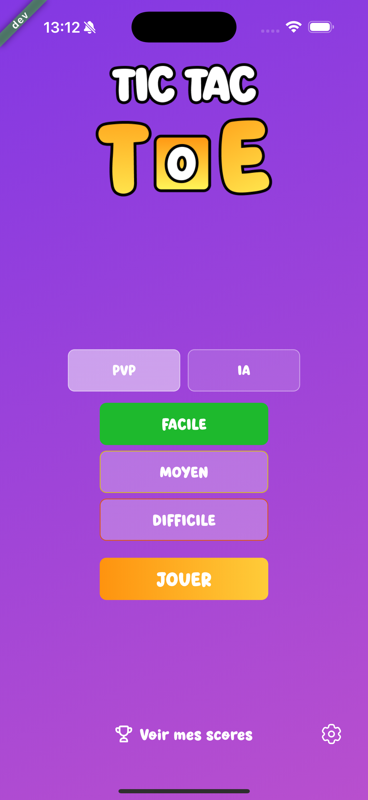
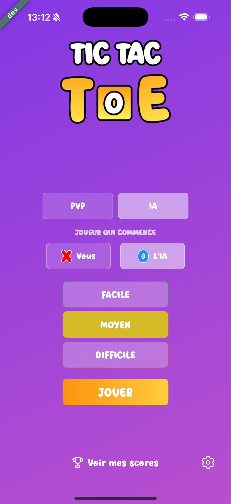
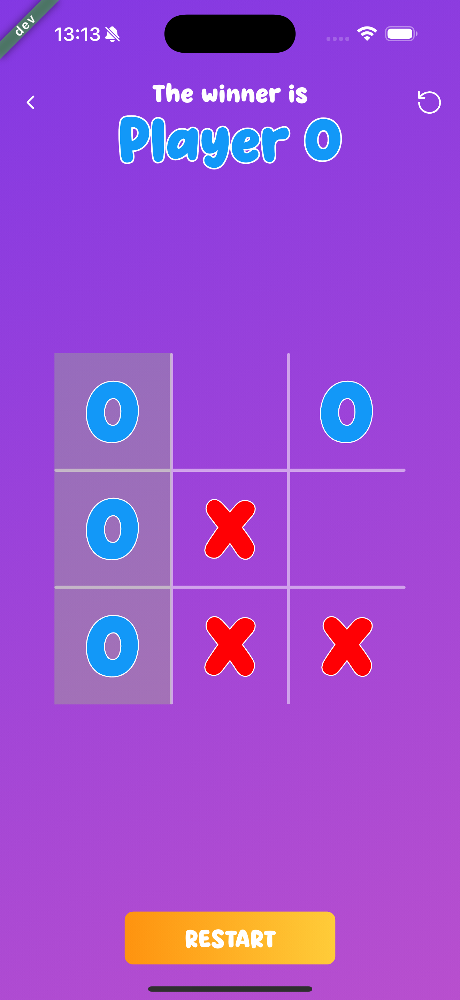
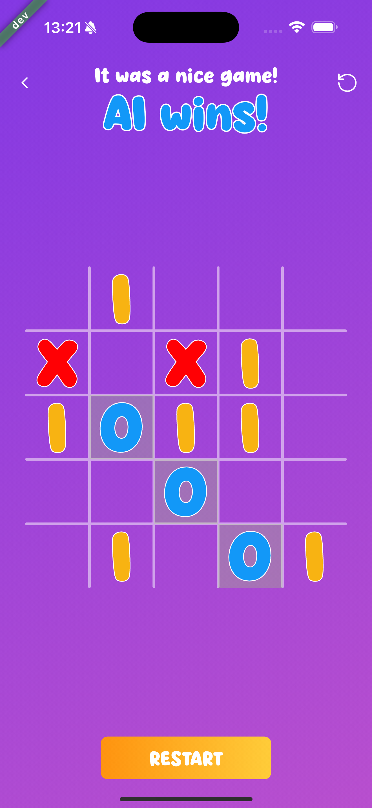
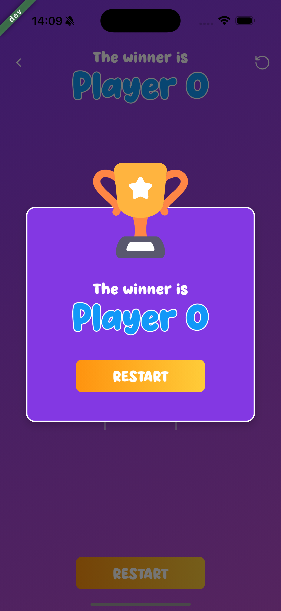
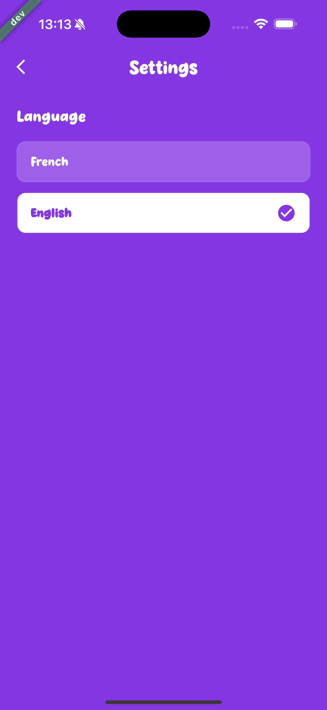

<div align="center">
  
</div>

# 🎮 Tic-Tac-TOE

Un jeu de Tic-Tac-TOE moderne, robuste et extensible, développé avec **Flutter**. Cette application a été conçue comme un test technique démontrant des pratiques de développement de haute qualité, incluant une architecture propre, des tests automatisés et une gestion d'état via RiverPod 2.

## 📱 Interfaces

### Page d'accueil

Lors du lancement du jeu, l'utilisateur se retrouve sur une page principale où il peut choisir son mode de jeu (PVP / PVE IA) et sa difficulté :

<div align="center">
  
  
</div>

### Page de jeu

Une fois dans le jeu, l'utilisateur peut choisir son pion (X ou O) et commence à jouer sur une grille en 3\*3, 4\*4 ou 5\*5, définit par la difficulté.

Lorsqu'un joueur remporte la partie, une animation de victoire est affichée.

<div align="center">
  
  
  
</div>

### Page de paramètres

Dans l'espace paramètres, l'utilisateur peut choisir son langage (Anglais ou Français).

<div align="center">
  
</div>

---

## 🚀 Fonctionnalités

### 🧠 Intelligence Artificielle

Jouez contre l'ordinateur avec trois niveaux de difficulté :

- **Facile** : Débutant, sur une grille en 3\*3.
- **Moyen** : Un défi équilibré avec une vision à court terme, sur une grille en 4\*4.
- **Difficile** : L'IA utilise algorithme renforcé (Minimax) pour être vraiment compétitive, sur une grille en 5\*5.

### 👥 Local PvP & Personnalisation

- Jouez contre un ami sur le même téléphone.
- **Choix du camp** : En mode IA, choisissez de commencer avec les **X** ou les **O**.
- **IA réactive** : Si vous choisissez de jouer second, l'IA joue son coup instantanément.

### 📂 Historique & Statistiques

- Suivez vos victoires, défaites et matchs nuls.
- Historique détaillé incluant le mode de jeu (IA ou PvP) et la difficulté.
- Persistance locale avec **Hive**.

### 🌍 Internationalisation (i18n)

- Support complet du **Français** et de l'**Anglais**.
- Détection automatique de la langue et changement depuis les paramètres.

---

## 🛠 Architecture Technique

L'application suit les principes de la **Clean Architecture** pour assurer la maintenabilité et la testabilité :

- **Domain** : Entités métier et Use Cases (Logique pure).
- **Data** : Modèles Hive, Repositories et Datasources.
- **Presentation** : Gestion d'état avec **Riverpod** et UI responsive.

### Stack Technique

- **Environnement** : Flavors (Dev, Staging et Prod) géré via flutter_flavorizr
- **State Management** : Riverpod 3.
- **Navigation** : AutoRoute.
- **Persistence** : Hive CE.
- **Traductions** : Easy Localization.
- **Design** : Système de design personnalisé avec dégradés.

---

## 💻 Installation & Développement

### Pré-requis

- Flutter SDK (v3.19.0+)
- Dart SDK

### Lancer le projet

```bash
flutter pub get

# Configurer les Git Hooks locaux (OBLIGATOIRE pour pusher)
sh scripts/setup_hooks.sh

flutter pub run build_runner build --delete-conflicting-outputs

# Lancer l'application (Flavor Dev)
flutter run --flavor dev -t lib/main.dart
```

### Tests

```bash
# Lancer tous les tests unitaires et d'intégration
flutter test
```

---

## 🗺 Prochaines Évolutions

Voici les prochaines étapes prévues pour enrichir l'expérience :

- [ ] **Mode En Ligne** : Jouer contre des amis à distance via Firebase ou WebSockets.
- [ ] **Animations UI** : Ajouter des effets de particules et des transitions fluides lors des victoires.
- [ ] **Personnalisation** : Thèmes de couleurs et icônes personnalisés pour les joueurs (X/O).
- [ ] **Statistiques Avancées** : Graphiques de progression et taux de victoire par difficulté.
- [ ] **Sons & Retours Haptiques** : Ajouter une immersion sonore et des vibrations lors des coups.
- [ ] **Achat In App** : Ajouter des achats in-app pour des thèmes ou des fonctionnalités premium.
